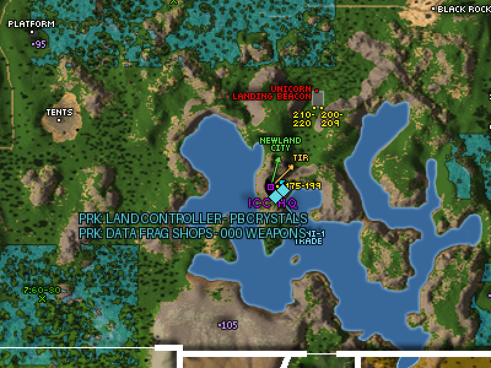

# PRK Map

The community in-game planet map for **[Project Rubi-Ka](https://project-rk.com/)** (Anarchy Online, patch 18.4). Shows up in your map selection as **"PRK Map"** so it's easy to tell apart from other map packs.

Based on **Atlas of Rubi-Ka v2.1.0** by Onack (2010) — the last great community map made for the pre-18.7 world, which means its data matches the PRK server exactly:

- All dyna camps with level ranges, era-correct for 18.4
- Dungeons (Subway, ToTW, Foreman's, IS, CoH, and more), grid exits, whompas, tower fields
- **PRK-specific markers** for things unique to the server (see legend below)

## Install

1. Download the latest `PRK-Map-vX.X.zip` from [Releases](../../releases)
2. In game, switch your map to *Default planetmap* first (P → map selection)
3. Extract the `PRKMap` folder into: `<your PRK client>\cd_image\textures\PlanetMap\`
4. Log fully out and back in, open the map (P) and select **PRK Map v1.1**

If the map window ever shows a load error, run `/setoption PlanetMapIndexFile normal/PlanetMapIndexNormal.txt` in chat and reopen the map.

## PRK marker legend

- 🔷 **Cyan diamond, `PRK:` prefix** — PRK-specific content (permanent). Colors match the GMI interface.
- 🔶 **Gold, `PRK:` prefix** — temporary/placeholder content that will move or change as the server develops.

Current PRK markers (v1.1): the Land Controller for PB crystals and the Data Fragment shops (000 weapons/upgrades), both at ICC HQ in Andromeda.

## Updates & requests

Found something that should be on the map? Stand at the spot in game, press **F9**, note the `Pos:` line, and ping **`.everkill`** on Discord with it (a screenshot helps).

## Credits

- **Onack** — Atlas of Rubi-Ka, the map this is built on
- **Finnagen** — CSPmap, which AoRK built upon
- **Demoder** — AO Map Compiler and planet map viewer tooling
- **Saavick** — preserving the classic AO maps on the Internet Archive
- The PRK community for location reports

Full edit history in [PRK-CHANGELOG.txt](PRK-CHANGELOG.txt).
